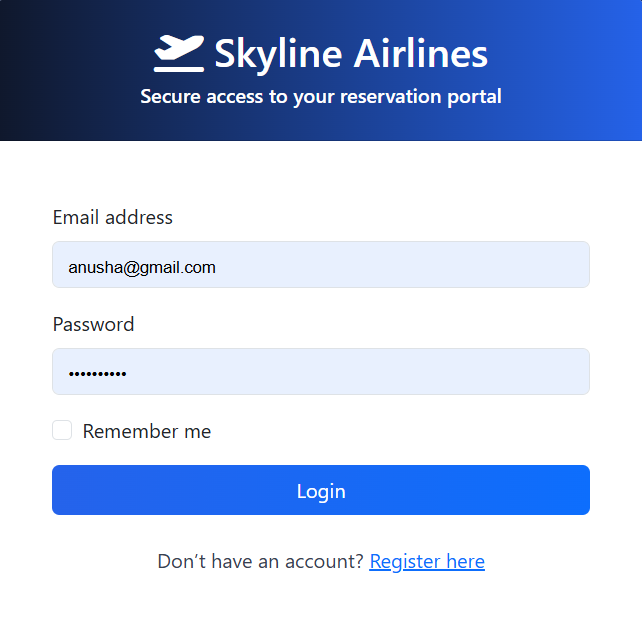

# ✈️ Airline Reservation System

A full-stack **Airline Reservation System** developed using **Flask, MySQL, HTML, CSS, JavaScript, Bootstrap, and Chart.js**. The application enables users to search flights, book tickets, make secure payments, download tickets and invoices, while administrators can manage flights, bookings, airlines, routes, schedules, and analyze business performance through interactive dashboards.

---

## 📌 Features

### 👤 User Module
- User Registration & Login
- Flight Search with Filters
- Flight Booking
- Passenger Management
- Secure Payment Processing
- Ticket Generation (PDF)
- Invoice Generation (PDF)
- Booking History
- Upcoming Trips Dashboard
- User Profile Management

### 👨‍💼 Admin Module
- Admin Dashboard
- Airline Management
- Flight Management
- Airport Management
- Route Management
- Flight Schedule Management
- Booking Management
- Payment Management
- User Management

### 📊 Business Analytics
- Revenue Analysis
- Booking Trend Analysis
- Occupancy Analysis
- Cancellation Analysis
- Customer Analytics
- Flight Performance Analysis
- Route Performance Analysis
- Executive KPI Dashboard
- SQL Reports
- CSV Export
- Power BI Dataset Export

---

## 🛠️ Technology Stack

| Category | Technologies |
|----------|--------------|
| Backend | Python, Flask |
| Database | MySQL |
| Frontend | HTML5, CSS3, Bootstrap 5, JavaScript |
| Charts | Chart.js |
| Data Analysis | Pandas, NumPy |
| Reporting | SQL, CSV Export |
| Visualization | Power BI |

---

## 📂 Project Structure

```
Airline-Reservation-System/
│
├── app.py
├── config.py
├── database/
├── models/
├── repositories/
├── routes/
├── services/
├── static/
│   ├── css/
│   ├── js/
│   └── images/
├── templates/
├── utils/
├── screenshots/
├── requirements.txt
└── README.md
```

---

## 🚀 Installation

### Clone the Repository

```bash
git clone https://github.com/AnushaValishetty2024/Airline-Reservation-System.git
```

### Move into the Project

```bash
cd Airline-Reservation-System
```

### Install Dependencies

```bash
pip install -r requirements.txt
```

### Configure Database

- Install MySQL
- Create a database named:

```
airline_reservation
```

- Import the SQL files from the `database/` folder.

### Run the Application

```bash
python app.py
```

The application will start at:

```
http://127.0.0.1:5000
```

---

# 📷 Project Screenshots

## Login Page



---

## User Dashboard


---

## Flight Search


---

## Flight Booking


---

## Payment


---

## Booking Details


---

## My Bookings


---

## Admin Dashboard


---

## Business Analytics


---

## Revenue & Booking Trends


---

## Customer Analytics


---

## SQL Reports

**

## 📈 Key Highlights

- Full-stack web application using Flask
- Responsive user interface with Bootstrap
- Role-based authentication (Admin/User)
- Business Analytics Dashboard
- Advanced SQL Reporting
- Interactive Charts using Chart.js
- Power BI Data Export
- Ticket & Invoice PDF Generation
- Clean MVC Architecture
- Repository-Service Design Pattern

---

## 🎯 Future Enhancements

- Online Payment Gateway Integration
- Email Notifications
- Seat Selection
- Dynamic Flight Pricing
- AI-based Fare Prediction
- Real-time Flight Status
- Mobile Application
- Multi-language Support

---

## 👩‍💻 Author

**Anusha Valishetty**

- GitHub: https://github.com/AnushaValishetty2024
- LinkedIn: https://www.linkedin.com/in/anushavalishetty/

---

## ⭐ Support

If you found this project useful, consider giving it a ⭐ on GitHub.
